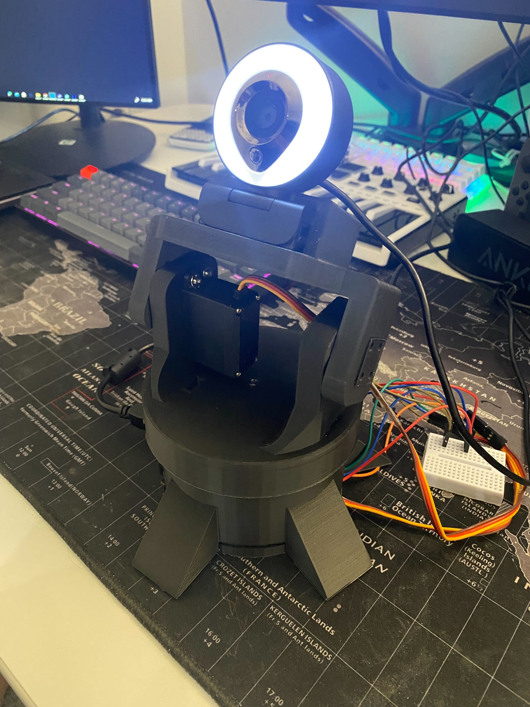

## Face-tracking camera

This is a face-tracking camera using OpenCV and an arduino. I will be testing my own custom model trained using a customized VGG16 architecture model and will be implementing both the pre-trained model within OpenCV (ResNet SSD). The camera will be able to track the face and center it to the middle of the screen.

## Getting Started

### Prerequisites

- Python 3.6
- OpenCV 3.4.2
- Numpy 1.15.4
- PySerial 3.4
- Arduino IDE

### Installing

- Install Python 3.6
- Install OpenCV 3.4.2
- Install Numpy 1.15.4
- Install PySerial 3.4
- Install Arduino IDE

## Running the tests

- Run the Arduino code on the Arduino IDE
- Run the Python code on the terminal

## Built With

- TensorFlow
- OpenCV
- Numpy
- PySerial
- Arduino IDE

## Use Case

- This is meant for stationary desktops with a webcam. The camera will be able to track the face and center it to the middle of the screen.

**Zoom use case:**

 
  

## Hardware Setup

- Arduino Uno
- Servo Motor x2
- Webcam
- Custom 3D printed gimbal (will be uploaded soon)

 
  
  

## ResNet SSD VS Custom Model

- ResNet SSD is a pre-trained model that is already trained on the COCO dataset. It is a very accurate model and is able to detect faces very well. However, it is not able to detect faces that are too far away from the camera. This is because the model is trained on the COCO dataset which does not have faces that are too far away from the camera.

 
  

- The custom model is trained on a custom dataset that I created. It is only able to detect my face (which was intended to be used for security purposes). Therefore, it is not as accurate as the ResNet SSD model. This is because the dataset is curated using a python script that takes pictures of my face from a webcam. The dataset also contains pictures of my face from different angles and different lighting conditions. The model is trained using a customized VGG16 architecture model. 

 
  

## Custom Model Training

- Detailed notebook [link](ObjectDetection_FaceTracking.ipynb)

## Author

- [**Daniel Choi**](https://github.com/jeongwoongc)

Shield: [![CC BY 4.0][cc-by-shield]][cc-by]

This work is licensed under a
[Creative Commons Attribution 4.0 International License][cc-by].

[![CC BY 4.0][cc-by-image]][cc-by]

[cc-by]: http://creativecommons.org/licenses/by/4.0/
[cc-by-image]: https://i.creativecommons.org/l/by/4.0/88x31.png
[cc-by-shield]: https://img.shields.io/badge/License-CC%20BY%204.0-lightgrey.svg